# Windows Persistence, Sysmon Monitoring and NSSM Service Lab

## Цель работы

В данной лабораторной работе были изучены:

- установка и настройка Sysmon;
- мониторинг процессов Windows;
- DNS logging через Sysmon;
- создание и удаление Windows service через NSSM;
- анализ событий Windows Event Viewer;
- поиск forensic artifacts после действий администратора;
- анализ Process Creation events;
- анализ DNS Query events.

---

# Используемые инструменты

| Инструмент | Назначение |
|---|---|
| Sysmon | Расширенный мониторинг Windows |
| Event Viewer | Просмотр журналов Windows |
| PowerShell | Управление системой |
| NSSM | Создание Windows service |
| Notepad | Тестовый процесс |
| Ping | Генерация DNS query |
| Sysmon Config | Расширенная конфигурация Sysmon |

---

# Что такое Sysmon

Sysmon (System Monitor) — инструмент Microsoft Sysinternals, который:

- логирует запуск процессов;
- логирует сетевую активность;
- логирует DNS запросы;
- показывает command line процессов;
- показывает parent process;
- показывает hashes файлов;
- помогает расследовать атаки.

---

# Установка Sysmon

## Проверка файлов Sysmon

Использовалась команда:

```powershell
dir C:\Sysmon
```

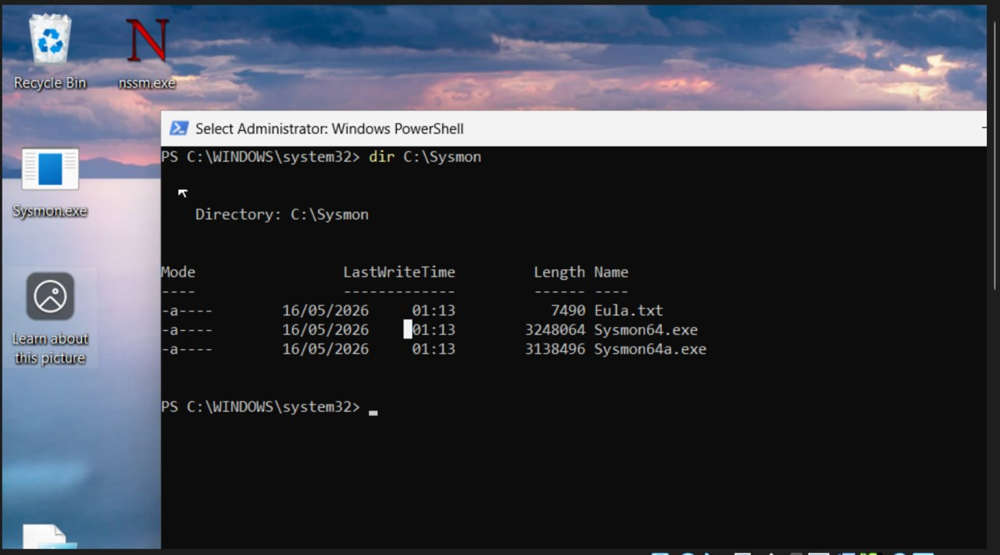

---

# Проверка сервиса Sysmon

```powershell
Get-Service Sysmon64
```

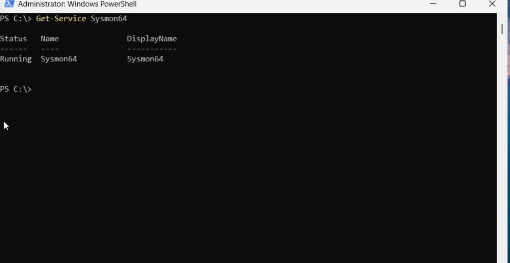

---

# Результат

Сервис Sysmon64 был успешно установлен и находился в состоянии:

```text
Running
```

---

# Первичная проблема

После установки Sysmon отображались только события:

- Event ID 1
- Event ID 4
- Event ID 5

DNS события отсутствовали.

---

# Причина

Sysmon был установлен без расширенной конфигурации.

По умолчанию Sysmon:
- не логирует DNS queries;
- не логирует многие полезные forensic события.

---

# Решение

Был скачан конфигурационный XML файл проекта:

```text
SwiftOnSecurity sysmon-config
```

---

# Создание папки для конфигурации

```powershell
mkdir C:\sysmon-config
```

---

# Проверка наличия XML файла

```powershell
dir C:\sysmon-config
```

---

# Применение Sysmon конфигурации

```powershell
C:\Sysmon\Sysmon64.exe -c C:\sysmon-config\sysmonconfig-export.xml
```

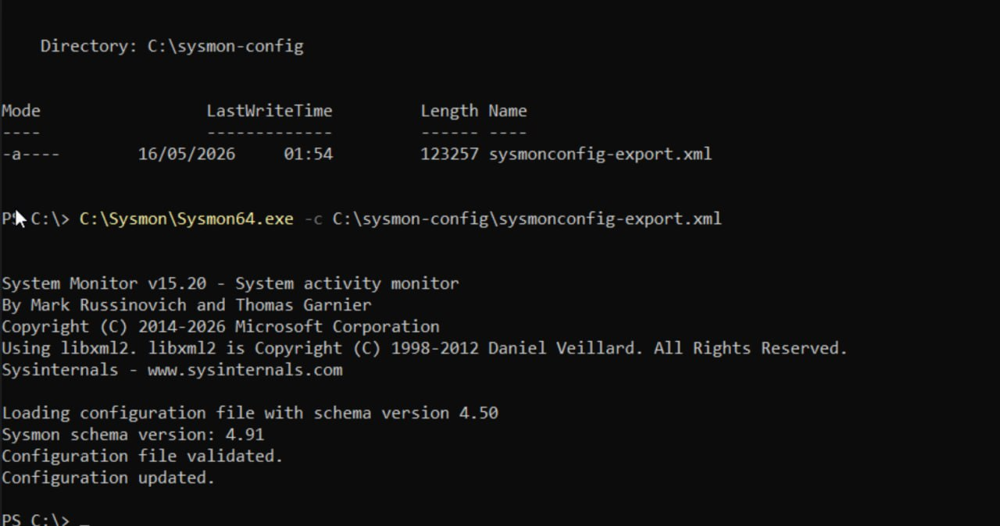

---

# Результат

Sysmon успешно загрузил XML конфигурацию:

```text
Configuration file validated.
Configuration updated.
```

---

# Что изменилось после конфигурации

После загрузки XML начали появляться:

- Event ID 22 (DNS Query)
- расширенные Process Creation events;
- дополнительные forensic artifacts.

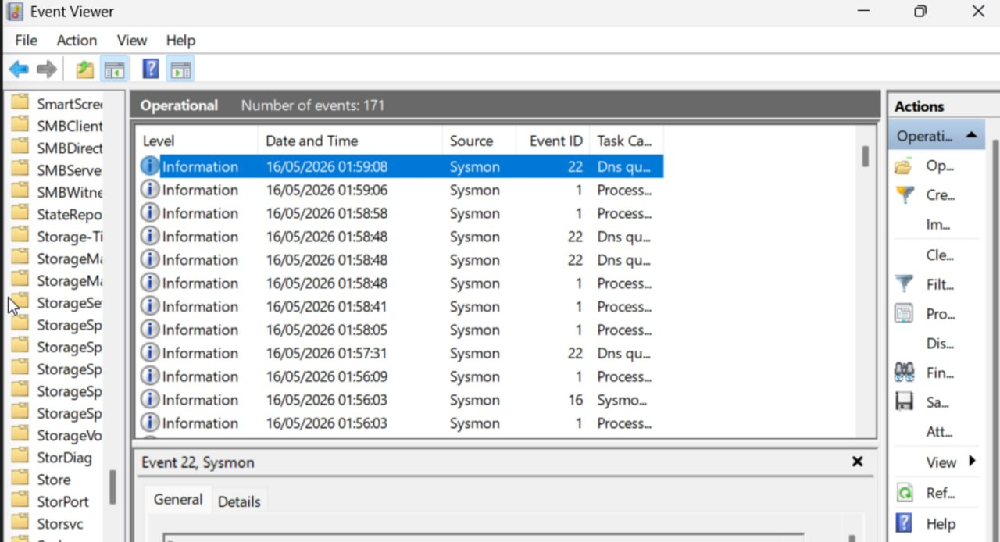

---

# Анализ Event ID 1 — Process Create

## Что означает Event ID 1

Event ID 1 =
создание нового процесса.

Sysmon показывает:

- executable;
- command line;
- пользователя;
- hashes;
- parent process;
- PID процесса.

---

# Генерация событий Process Create

Были запущены:

```powershell
notepad
calc
```

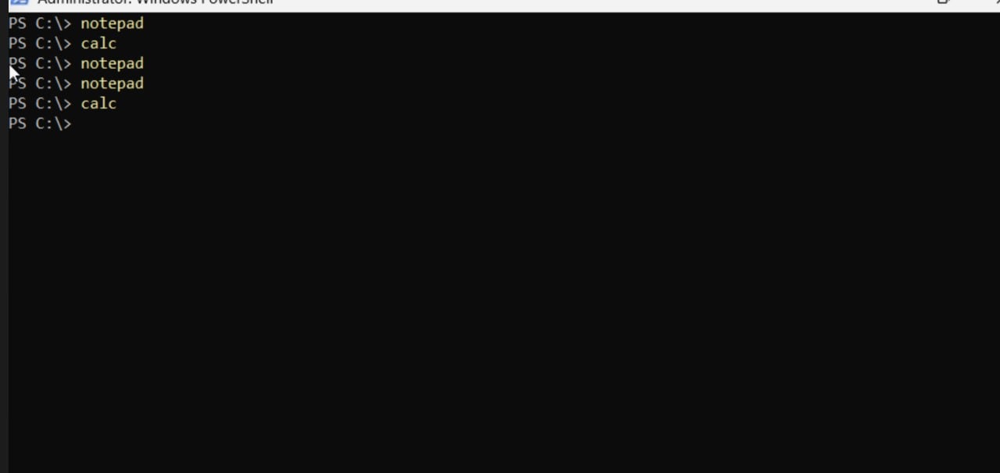

---

# Пример процесса whoami.exe

В Event Viewer появился:

```text
Image:
C:\Windows\System32\whoami.exe
```

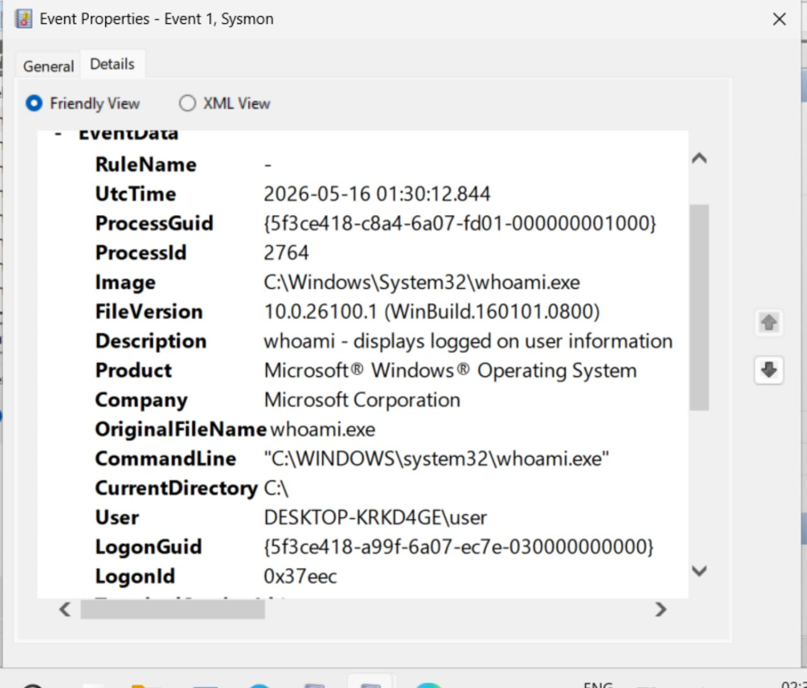

---

# Что также логировалось

Sysmon показал:

- ProcessId;
- CommandLine;
- CurrentDirectory;
- User;
- IntegrityLevel;
- MD5 hash.

---

# Почему это важно

Это используется в:

- DFIR (Digital Forensics and Incident Response);
- malware analysis;
- threat hunting;
- SOC monitoring;
- EDR detection.

---

# Анализ Event ID 22 — DNS Query

## Что означает Event ID 22

Event ID 22 =
DNS запрос процесса.

Sysmon показывает:

- какой процесс делал DNS запрос;
- какой домен запрашивался;
- какой пользователь выполнял процесс;
- результаты DNS resolution.

---

# Генерация DNS события

Использовалась команда:

```powershell
ping google.com
```

---

# Результат в Sysmon

Sysmon создал Event ID 22:

```text
QueryName:
google.com
```

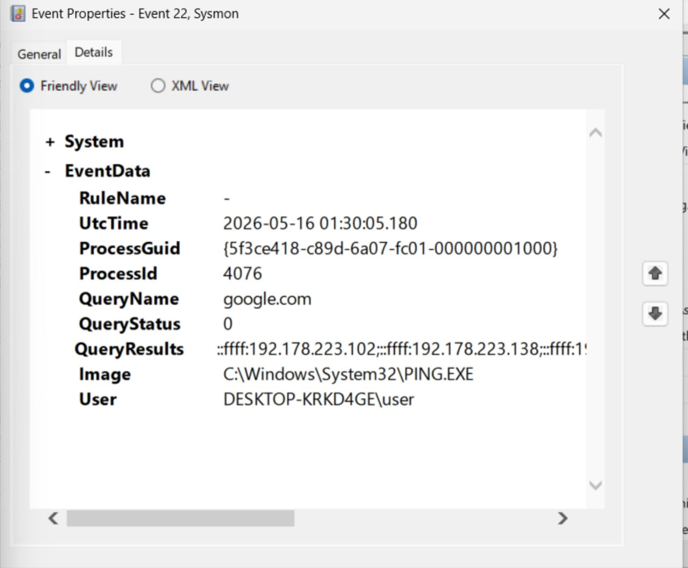

---

# Какой процесс выполнил запрос

```text
Image:
C:\Windows\System32\PING.EXE
```

---

# Почему это важно

DNS logging позволяет:

- искать malware beaconing;
- искать command-and-control traffic;
- расследовать suspicious domains;
- анализировать активность процессов.

---

# Анализ Event ID 11 — File Create

## Что означает Event ID 11

Event ID 11 =
создание файла процессом.

Sysmon показывает:

- какой процесс создал файл;
- путь к файлу;
- пользователя;
- timestamp события.

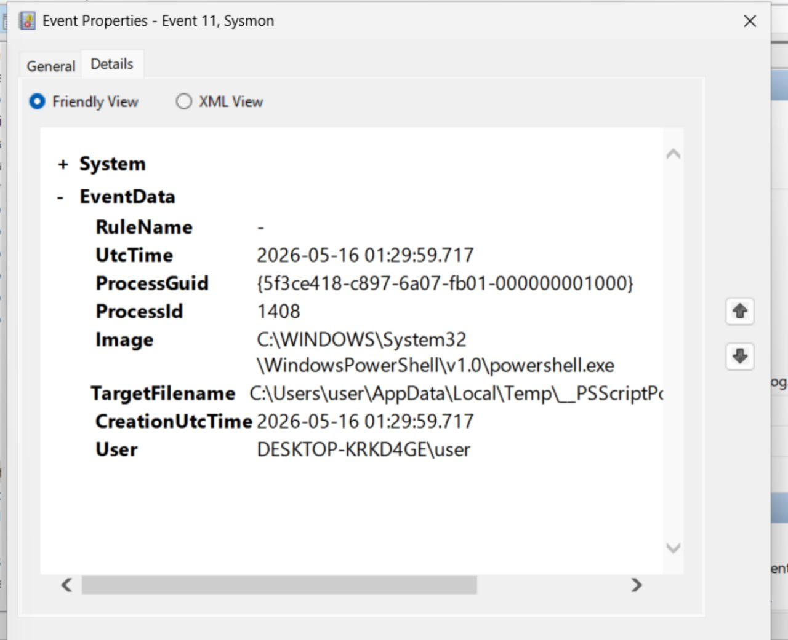

---

# Почему это важно

File Create events помогают:

- искать malware droppers;
- анализировать persistence;
- отслеживать suspicious file activity;
- расследовать ransomware activity.

---

# Создание службы через NSSM

## Что такое NSSM

NSSM =
Non-Sucking Service Manager.

Используется для:
- запуска программ как Windows service;
- persistence;
- automation;
- monitoring scripts.

---

# Создание PowerShell monitor script

Был создан файл:

```powershell
monitor.ps1
```

Скрипт записывал процессы в лог:

```powershell
while ($true) {
    Get-Process | Out-File C:\monitor\process_log.txt
    Start-Sleep -Seconds 10
}
```

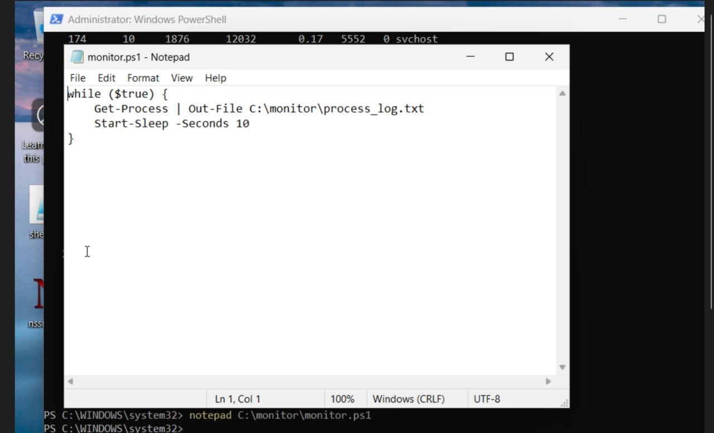

---

# Запуск monitor.ps1

```powershell
powershell -ExecutionPolicy Bypass -File C:\monitor\monitor.ps1
```

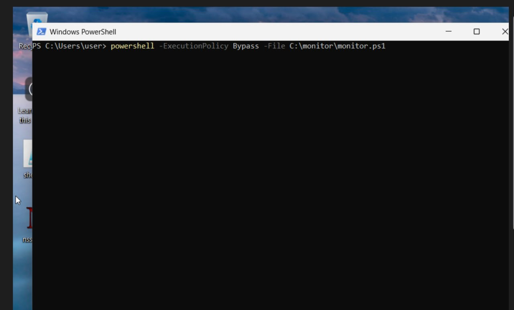

---

# Проверка содержимого папки monitor

```powershell
dir C:\monitor
```

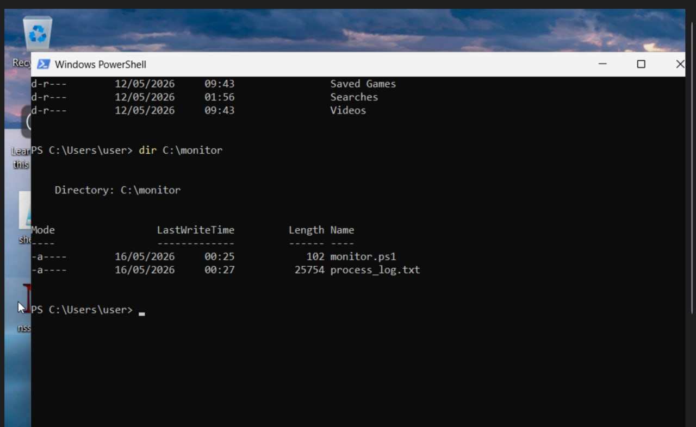

---

# Просмотр process_log.txt

```powershell
type C:\monitor\process_log.txt
```

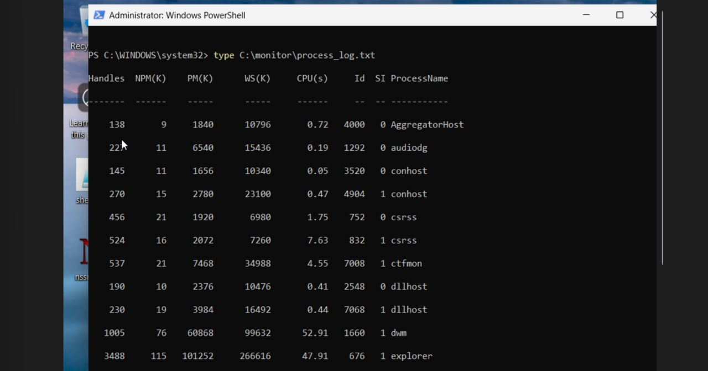

---

# Ошибка при установке NSSM

При попытке установки NSSM без администратора появилась ошибка:

```text
Administrator access is needed to install a service.
```

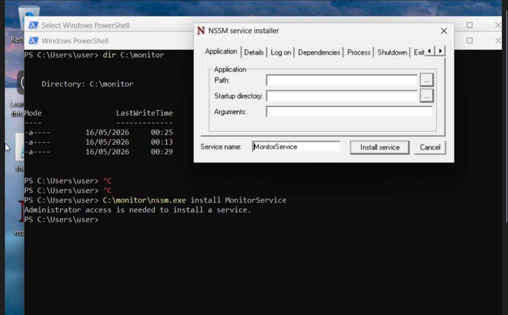

---

# Создание сервиса

Был создан service:

```text
MonitorService
```

---

# Установка сервиса

Сервис был успешно установлен через NSSM.

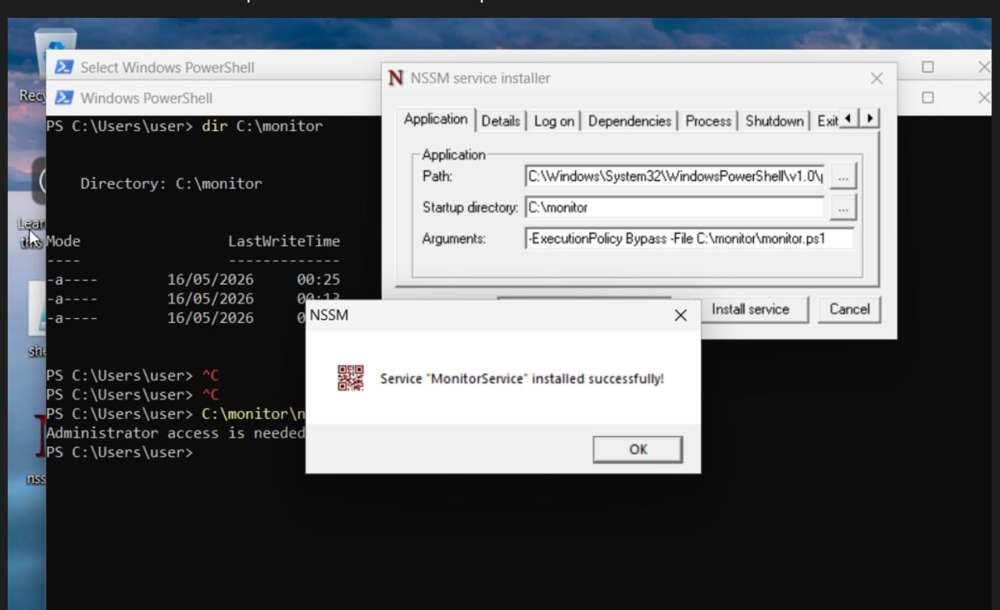

---

# Проверка работы сервиса

Использовалась команда:

```powershell
Get-Service MonitorService
```

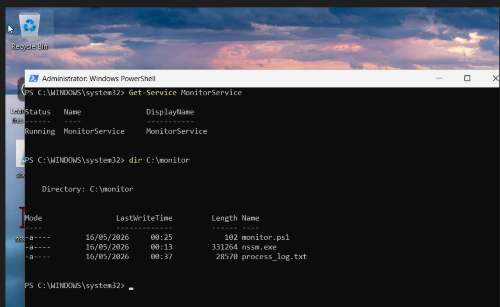

---

# Изменение monitor.ps1 для сетевого мониторинга

Скрипт был изменен:

```powershell
while ($true) {
    Get-NetTCPConnection | Out-File C:\monitor\netlog.txt
    Start-Sleep 10
}
```

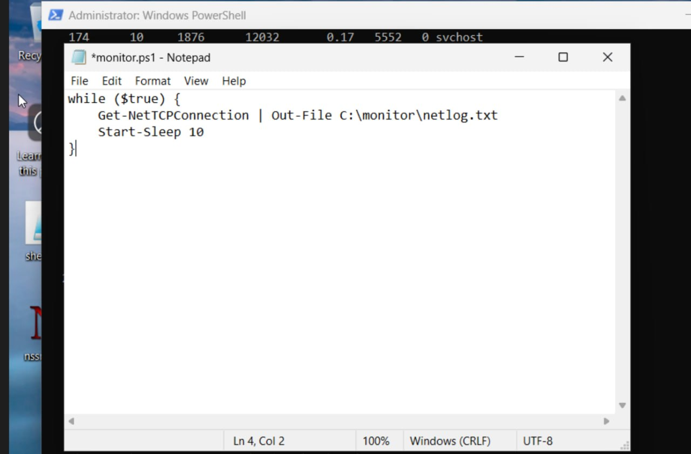

---

# Перезапуск сервиса

```powershell
Restart-Service MonitorService
```

---

# Проверка netlog.txt

```powershell
type C:\monitor\netlog.txt
```

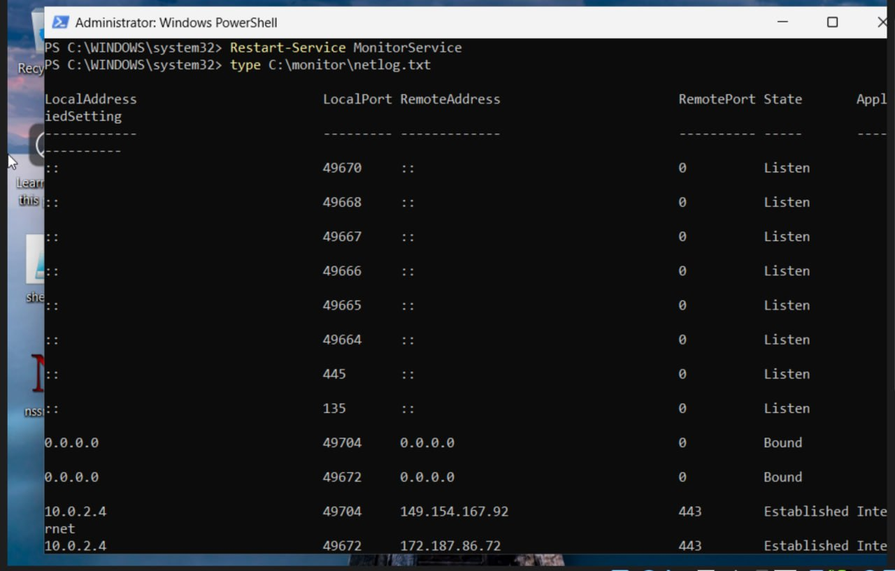

---

# Анализ PowerShell логов

В Event Viewer были обнаружены PowerShell ScriptBlock logs:

```text
Event ID 4104
```

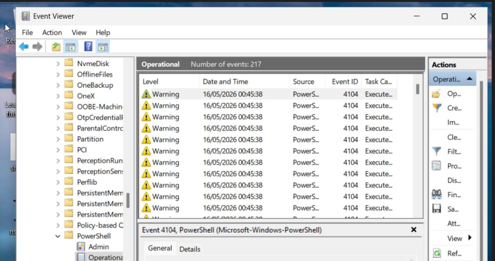

---

# Остановка сервиса

```powershell
Stop-Service MonitorService
```

---

# Проверка остановки

```powershell
Get-Service MonitorService
```

---

# Удаление сервиса

Использовалась команда:

```powershell
C:\monitor\nssm.exe remove MonitorService confirm
```

---

# Ошибка при удалении

Первоначально была допущена ошибка:

```powershell
nssme.exe
```

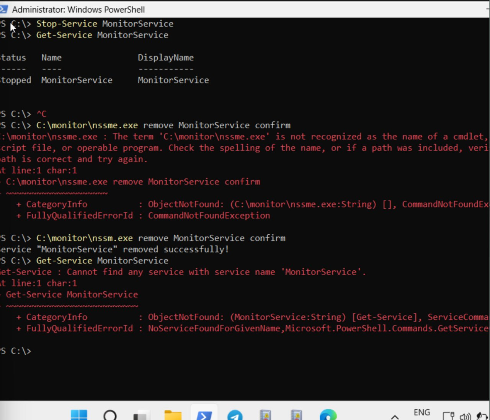

---

# Причина ошибки

Файл назывался:

```powershell
nssm.exe
```

а не:

```powershell
nssme.exe
```

---

# Почему это важно

Подобные ошибки:
- постоянно происходят в SOC;
- встречаются в pentest;
- встречаются в incident response;
- требуют troubleshooting.

---

# Результат удаления

После исправления команды:

```text
Service "MonitorService" removed successfully!
```

---

# Проверка удаления

Команда:

```powershell
Get-Service MonitorService
```

вернула:

```text
Cannot find any service with service name 'MonitorService'
```

---

# Анализ Windows Event Logs

## Event ID 7045

Было найдено событие:

```text
Event ID 7045
```

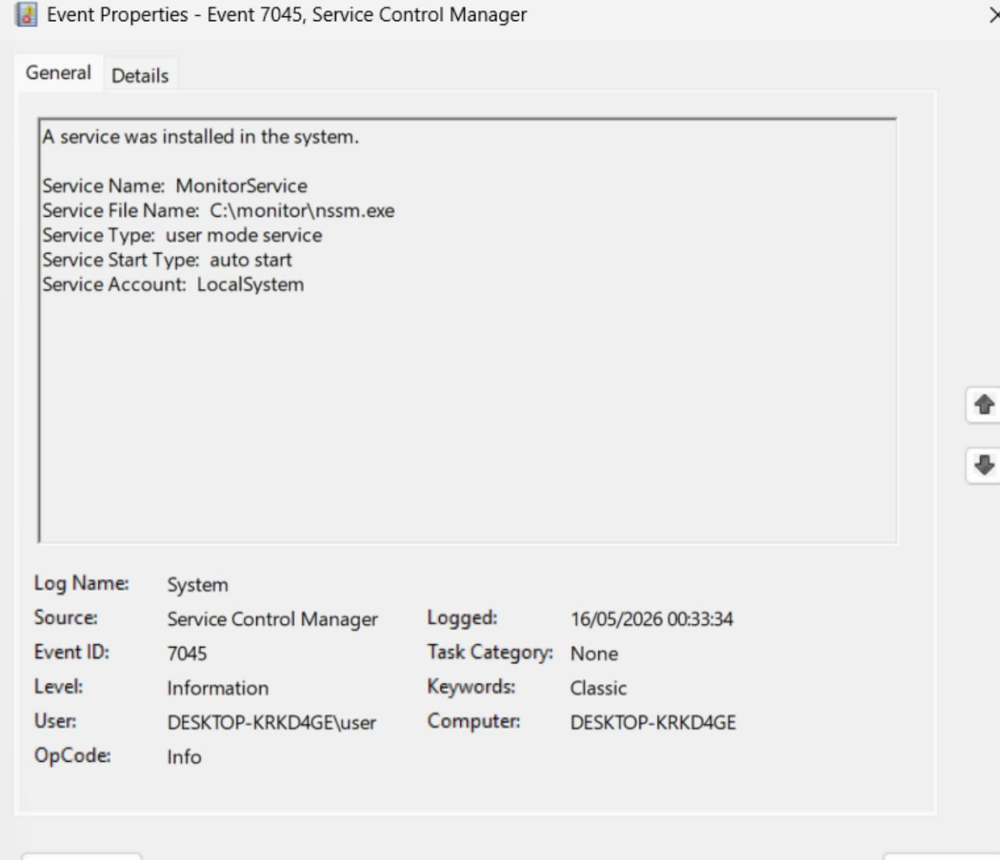

---

# Что означает 7045

7045 =
установка нового Windows service.

---

# Что содержал event

Event показал:

- Service Name;
- путь к executable;
- startup type;
- service account.

---

# Почему это важно

7045 часто используется для:
- persistence;
- malware installation;
- lateral movement;
- privilege escalation.

---

# Что было изучено

В ходе лабораторной работы были изучены:

- Windows forensic artifacts;
- Sysmon logging;
- Process monitoring;
- DNS logging;
- Windows Services;
- NSSM persistence;
- Event Viewer analysis;
- troubleshooting ошибок;
- service lifecycle events.

---

# Основные Event ID

| Event ID | Назначение |
|---|---|
| 1 | Process Create |
| 4 | Sysmon service state |
| 5 | Process terminated |
| 11 | File Create |
| 22 | DNS Query |
| 4104 | PowerShell ScriptBlock |
| 7045 | Service installed |

---

# Вывод

В ходе лабораторной работы была успешно выполнена настройка Sysmon и расширенного мониторинга Windows.

Были получены навыки:

- установки Sysmon;
- применения XML конфигурации;
- анализа Process Creation logs;
- анализа DNS Query logs;
- создания и удаления Windows services;
- поиска forensic artifacts в Event Viewer;
- расследования активности процессов.

Также была изучена работа Windows logging и способы обнаружения активности через Sysmon и Event Viewer.
````
